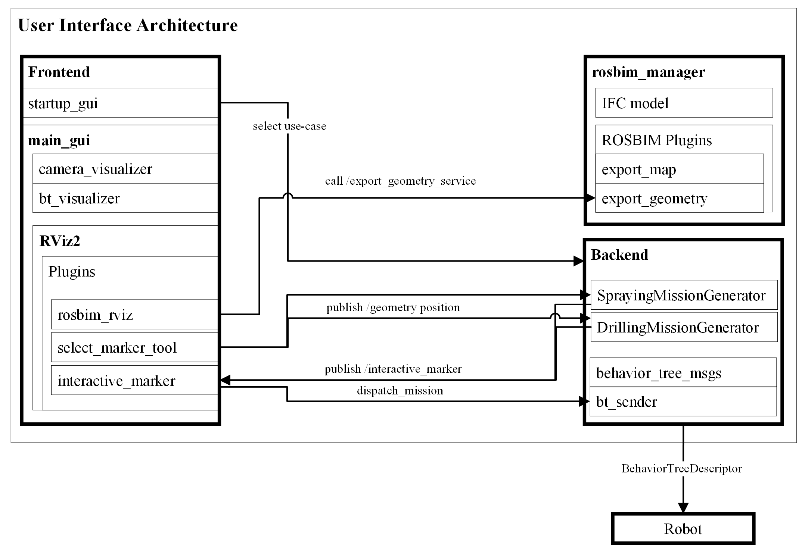

# CONCERT Application Workspace

Author: [Michael Terzer](michael.terzer@fraunhofer.it) Fraunhofer Italia 2023

# 1. Description

This workspace contains packages for the top level interaction with the concert application. It contains:

1. the user-interface frontend
2. the user-interface backend
3. the rosbim packages

The architecture can be seen in the following graphics:



Normally this workspace is located on a remote machine (e.g. laptop or steamdeck) and the robot is connected through wifi.

To visualize the robot state, the robot descriptions must be imported into this workspace so that RViz can load the mesh files locally.

# 2. Installation

1. Clone submodules:
   
   ```
   git submodule update --init --recursive
   ```

2. Build docker container:
   
   ```
   cd docker && docker compose up --build
   ```
   
   
   

# 3. How to run

The graphical user interface can be run with several parameters:

```bash
ros2 launch user_interface bringup.launch.py bim_file:="/concert_application_ws/src/_user_interface/bim_files/NOI_D3_FRAUNHOFERITALIA.ifc" rviz_file:=drilling gui_config:=gui_config
```

Consult `docker/roser.yaml` for further parameters.

The mission generator can be run by:

```
ros2 run concert_mission_generator drilling_mission_generator.py --ros-args -p use_sim_time:=true
```

# 4. Export Map from ROSBIM

Open a new terminal in the concert_application container.
Start the export_map plugin:

```
ros2 run rosbim_manager spawner.py --name rosbim_export_map_plugin
```

Export a map:

```
ros2 service call /export_map_plugin_node/export_map rosbim_export_map_plugin/srv/ExportMapService "resolution: 0.1
section_heights: [5.0]"
```

# 5.  Licence

concert_application_ws is licensed under the terms of the Apache License 2.0. The project has recieved financial support by the Horizon 2020 EU Project CONCERT.

# 6. Citation

```
@article{Terzer2024,
 title = {A Facilitated Construction Robot Programming Approach using Building Information Modelling},
 author = {Terzer, Michael and Flatscher, Tobit and Magri, Marco and Garbin, Simone and Emig, Julius and Giusti, Andrea},
 journal = {10th International Conference on Control, Decision and Information Technologies CoDIT24},
 year = {2024},
 note = {to be published},
 publisher={IEEE}
}
```
