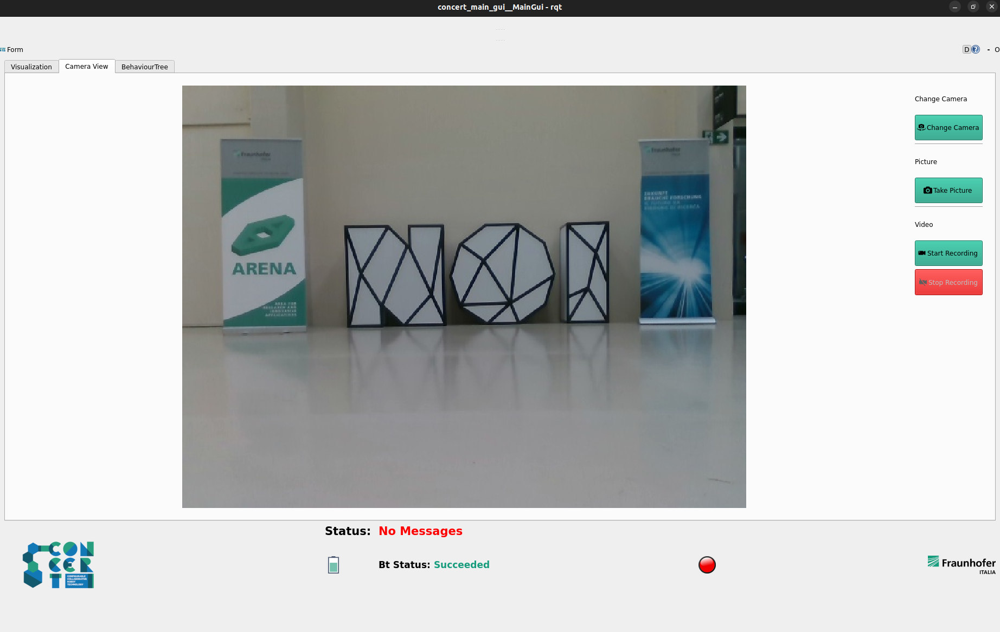

# Concert Camera Widget

Authors: [Simone Garbin](simone.garbin@fraunhofer.it) Fraunhofer Italia 2023-2024

This package provides the camera tab of Graphical User Interface that displays the video stream from the robot's cameras.

  

With **Change Camera** button the user can switch between the cameras mounted on the platform.

With **Take Picture** button the user can save a picture.

With **Start Recording** and **Stop Recording** buttons the user can start and stop the video recording.

# Installation and usage

This package is used in combination with the tools from the concert_application_ws (in particular with the concert_mission_generator).

For more information on the individual tabs, see the corresponding packages.

For indications how to run, consult concert_application_ws.

# Licence & Acknowledgement

The camera_widget is licensed under the terms of the Apache License 2.0. The project has recieved financial support by the Horizon 2020 EU Project [CONCERT](https://concertproject.eu/).

