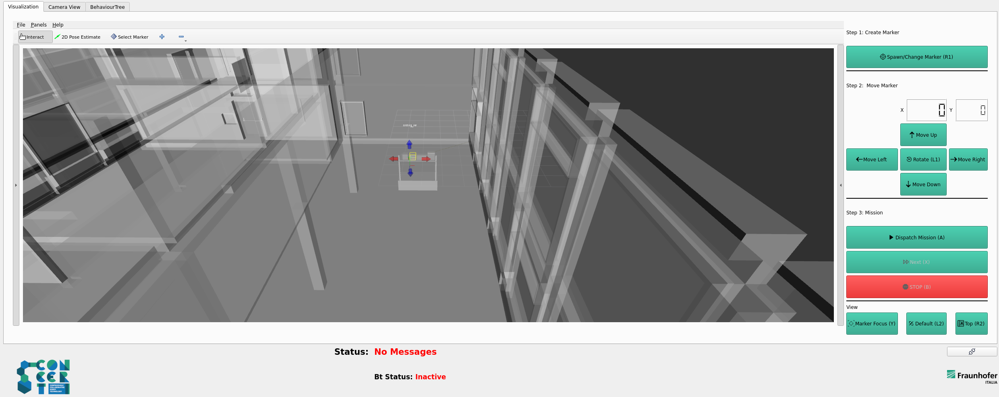

# Concert Drilling Widget

Authors: [Simone Garbin](simone.garbin@fraunhofer.it) Fraunhofer Italia 2023-2024

This package provides the drilling widget of Graphical User Interface that displays the robot's model in a Rviz view and allows the user to spawn an interactive marker representing where a hole is to be drilled.

  

The user has the option of changing the wall to be drilled via the button.

Then the user can rotate the marker or translate it with the appropriate buttons.

Finally, the user can start the mission with the **Dispatch Mission** button, perform the **Next** operation or **Stop** the current mission.

It is also possible, with the appropriate buttons, to change the view to have a default view, a marker focus or a top-view.

# Installation and usage

This package is used in combination with the tools from the concert_application_ws (in particular with the concert_mission_generator).

For more information on the individual tabs, see the corresponding packages.

For indications how to run, consult concert_application_ws.

# Licence & Acknowledgement

The rqt_rviz_drilling_widget is licensed under the terms of the Apache License 2.0. The project has recieved financial support by the Horizon 2020 EU Project [CONCERT](https://concertproject.eu/).
