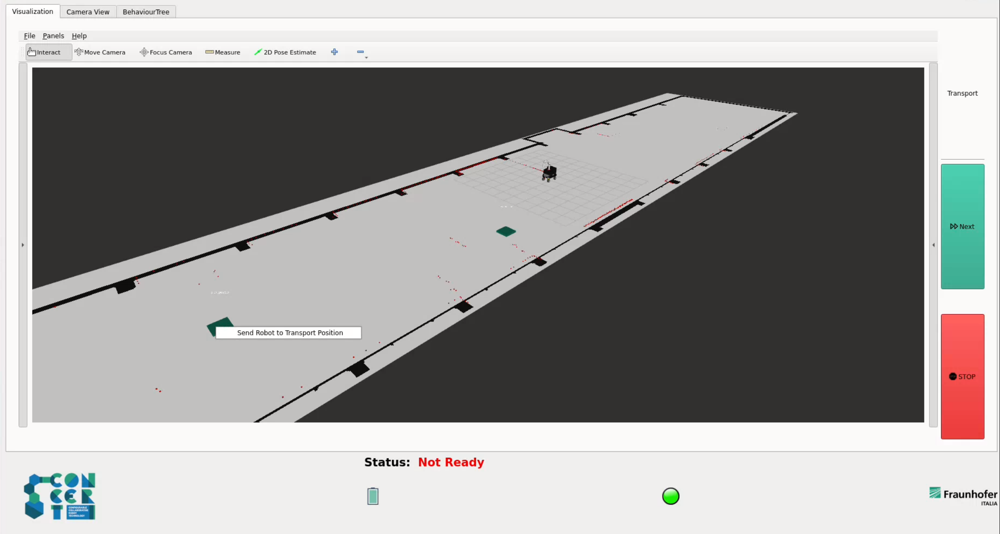

# Concert Transport Widget

Authors: [Simone Garbin](simone.garbin@fraunhofer.it) Fraunhofer Italia 2023-2024

This package provides the transport widget of Graphical User Interface that displays the robot's model in a Rviz view and allows the user to send the robot to predefined positions on the map.

  

The user can select one of the markers on the map and right-click to send the robot to the corresponding position.

Then, with the **Next** button the user can start the collaborative transport procedure with the platform, following the instructions displayed in the Status bar.

# Installation and usage

This package is used in combination with the tools from the concert_application_ws (in particular with the concert_mission_generator).

For more information on the individual tabs, see the corresponding packages.

For indications how to run, consult concert_application_ws.

# Licence & Acknowledgement

The rqt_rviz_transport_widget is licensed under the terms of the Apache License 2.0. The project has recieved financial support by the Horizon 2020 EU Project [CONCERT](https://concertproject.eu/).
